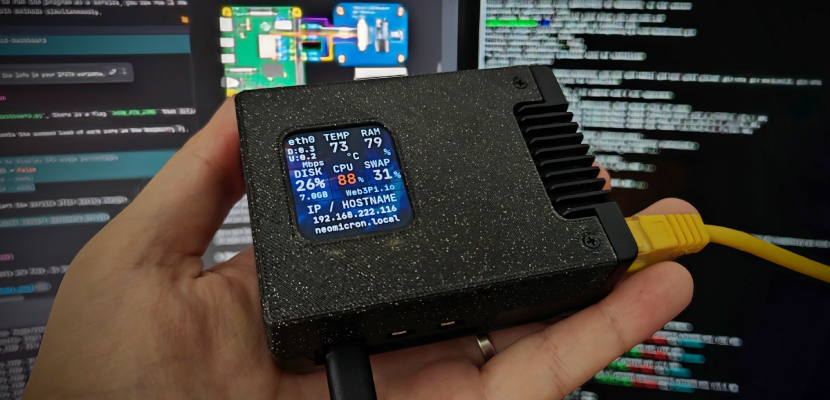
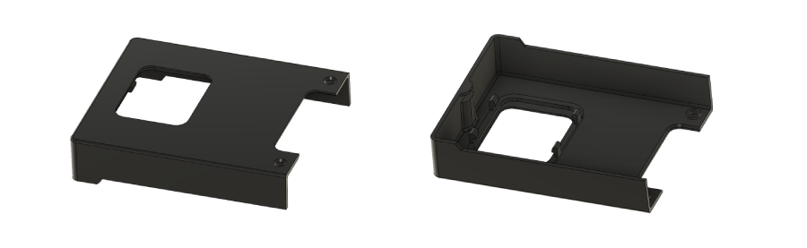

# LCD Dashboard for Raspberry Pi SBCs

<p align="center">
  
</p>

<p align="left">
<a href="https://hits.seeyoufarm.com"></a>
<a href="/LICENSE"></a>
</p>


***Unique hardware dashboard for Raspberry Pi 4 and Raspberry Pi 5 with 3D model for Argon Neo 5 enclosure*** 

***This repository is part of the [Web3 Pi](https://www.web3pi.io) initiative, which enables the automated deployment of a full Ethereum node on a Raspberry Pi.***

This project displays Raspberry Pi system and service status on a color SPI LCD.
Configure the dashboard in **YAML**, without editing Python source code:

- CPU, temperature, memory, disk, uptime and system load
- IP address, hostname and network interface
- Home Assistant, AdGuard, OpenCCU/piVCCU, Pi-hole v6 and Proxmox status
- Classic cards and ring displays in a configurable grid
- Multiple overview pages and detail pages with optional GPIO buttons
- Optional shutdown and reboot buttons with a preparation command

Start with [config.example.yaml](config.example.yaml). The
[configuration guide](docs/Configuration.md) contains the complete option
reference and 13 configuration examples.

We have designed our own 3D model of the enclosure cover with a space for the display. The assembly is simple, using snap-fits, with no tools required. The models are open-source, so anyone can print them on a 3D printer. The source code is also open-source, allowing users to add new functionalities, customize it to their needs, or add support for new displays.

## Disclaimer

Raspberry Pi is a trademark of Raspberry Pi Ltd. The use of this trademark here is solely for descriptive purposes. I am not affiliated with Raspberry Pi Ltd. I derive no financial benefit from this content.

## Requirements

- Python >= 3.9
- Run on Raspberry Pi 4 and 5
- Raspberry Pi OS or Ubuntu
- [SPI interface enabled](docs/EnableSPI.md)
- A supported SPI LCD: 2-inch (default, landscape 320×240) or 1.69-inch (280×240)
- For the 1.69-inch ST7789V2 display:
  - Waveshare 24382 - [product page](https://www.waveshare.com/1.69inch-lcd-module.htm)
  - Seeed Studio 104990802 - [product page](https://www.seeedstudio.com/1-69inch-240-280-Resolution-IPS-LCD-Display-Module-p-5755.html)
- (Optional) 3D printed model of Argon Neo 5 cover
- (Optional) Argon Neo 5 enclosure


## Assembly

### 1. Connect wires
Connect the display to the Raspberry Pi according to the diagram below.  
The colors of the cables may vary depending on the supplier and batch. Focus on the function and pin number, not the color.

   
Diagram is valid for Raspberry Pi 4 and Pi 5

If on Raspberry Pi 5 your LCD backlight is flickering connect `BL` to `3.3V PIN 17`

### 2. Mount display module

Mount the display in the printed enclosure cover. The display is held in place by four clips. Make sure all 3D printing support residues are removed and the surface to which the display adheres is flat. Install the display by sliding one side under the clips first, then pressing the other side down. Do not use excessive force to avoid damaging the display. The display should fit in easily.

Since each 3D printer may be calibrated differently, it may be necessary to adjust the scale of the 3D model in the slicer software before printing. Our prints are done on [Original Prusa i3 MK3S+](https://www.prusa3d.com/pl/produkt/drukarka-3d-original-prusa-i3-mk3s-3/).

### 3. Mount enclosure cover

Mount the enclosure cover and secure it with two screws. Make sure to arrange the cables inside the enclosure so they do not obstruct the fan and minimize interference with cooling.

## Installation

To enable the display, the SPI interface must be enabled.  
To do this, execute the following command and then reboot the device:

```shell
sudo sed -i '/^#dtparam=spi=on/s/^#//' /boot/firmware/config.txt
sudo reboot
```

Download the repository.

```shell
sudo apt-get -y install git
git clone https://github.com/leonsio/2inch-pi-lcd-dashboard.git
```

Create your local configuration before starting the dashboard:

```shell
cd 2inch-pi-lcd-dashboard
cp config.example.yaml config.yaml
nano config.yaml
```

Choose `LCD_DEVICE: '2inch'` or `LCD_DEVICE: '1inch69'`, enter your service
addresses/tokens and customize the pages. `config.yaml` is excluded from Git.
Commands below assume you start in the parent directory; if already inside the
repository, omit the repeated `cd`.

Then, you can run the program as a service. The program will start automatically with the system startup.  
Alternatively, you can run it once. The program will stop when you close the console.

### Run as a service - (recommended)   

```shell
cd 2inch-pi-lcd-dashboard
chmod +x *.sh
sudo ./create_service.sh
```

To **stop** the program, execute `sudo systemctl stop dashboard.service`

To **uninstall** the service, execute `sudo ./remove_service.sh`

### or run one time

If you do not want to run the program as a service, you can run it once.   
Note: Do not use both methods simultaneously.

```shell
cd 2inch-pi-lcd-dashboard
chmod +x *.sh
sudo ./run.sh
```
To stop the program, press Ctrl+C.

## Configuration

Edit `config.yaml` in the repository directory. For example:

```yaml
LCD_DEVICE: '2inch'
SHOW_PER_CORE: false
DISPLAY_BACKLIGHT: 80
BUTTONS_ENABLED: false
PAGES:
  - name: system
    layout:
      row1cell1: cpu_ring
      row1cell2: ram_ring
      row1cell3: disk_ring
      row2cell1: temp_ring
      row2cell2: {module: network, colspan: 2}
      row3cell1: {module: uptime, colspan: 3}
```

Omitted settings inherit from `config.example.yaml`; `PAGES` replaces the entire
example page list. Use `true`/`false` for booleans, `null` for no value, and quote
colors such as `'#FFFFFF'`. `SHOW_PER_CORE: false` displays average CPU usage
(0–100%); `true` sums all cores (0–400% on a four-core Pi).

The installer installs PyYAML and checks the configuration before starting the
service. You can also validate without accessing the hardware:

```shell
sudo ./run.sh --prepare-only
venv/bin/python dashboard_config.py
sudo systemctl restart dashboard.service
```

For display selection, GPIO wiring, page navigation, spanning cards, themes,
fonts, polling, service APIs and power actions, see the
[extended configuration documentation](docs/Configuration.md).

## 3D Model

The models are free, so anyone can print them on a 3D printer.



Download 3D model: [3D_Model](docs/3D_Model)

## 3D Printing

We recommend printing with [PETG](https://botland.store/849-petg-filaments?manufacturers=devil-design,prusa&weight=1000-g&material=petg&diameter=1-75-mm) filament due to the high operating temperatures of the Raspberry Pi.  
To ensure the snap-fits print correctly, enable 'supports everywhere.'  
Use a 0.4 mm nozzle.  
0.2 mm layer height or smaller.  
Our models are printed on [Original Prusa i3 MK3S+](https://www.prusa3d.com/pl/produkt/drukarka-3d-original-prusa-i3-mk3s-3/)

If you do not have access to a 3D printer, you can order an online print from one of the providers such as [JLC3DP](https://jlc3dp.com/3d-printing-quote).   
There are various materials technology and you can choose from:
- FDM - ABS, ASA or PA12-CF
- MJF - PA16-HP Nylon
- SLS - 3201PA-F Nylon


## Contribution

Are you passionate about open-source development? We invite you to contribute to our GitHub repository! Whether you're a seasoned developer or just starting out, your ideas, code, and feedback are invaluable. Join our community, collaborate with like-minded individuals, and help us build something amazing together. Every contribution, no matter how small, makes a difference. Fork the repo, dive into the issues, and let's make this project even better!
